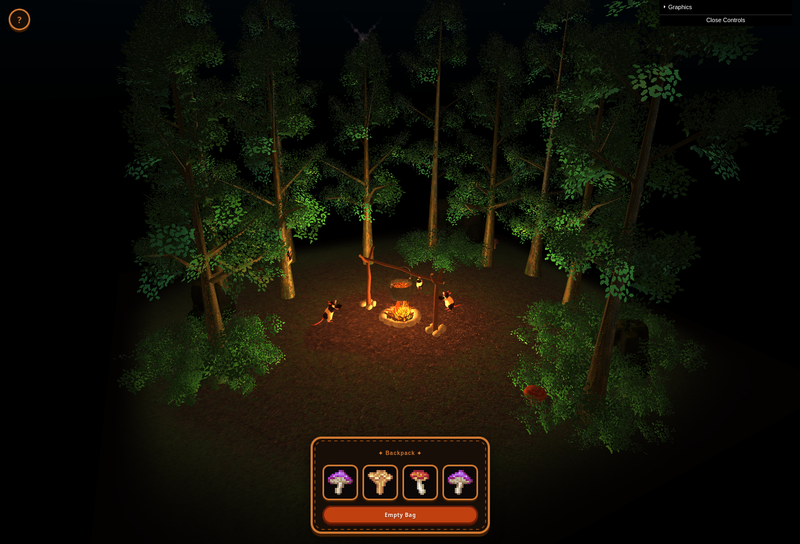

# Soup in the Woods - Computer Graphics Project

Soup in the Woods is a small interactive game developed for my Computer Graphics course entirely in WebGL, GLSL and Javascript. In there you can pick some mushrooms around a night forest fire and cook some soup for some small mice. 

The app is available for live preview at https://francescaguzzi.github.io/soupinthewoods

